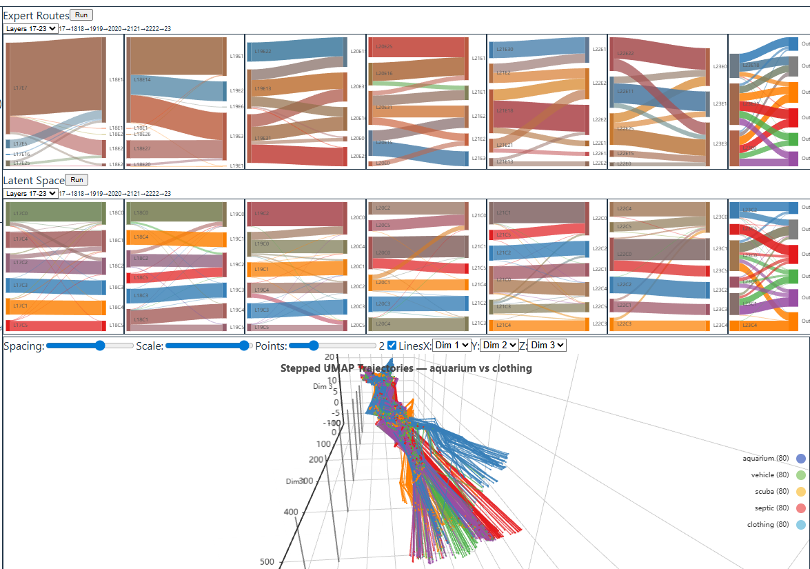
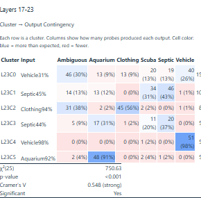
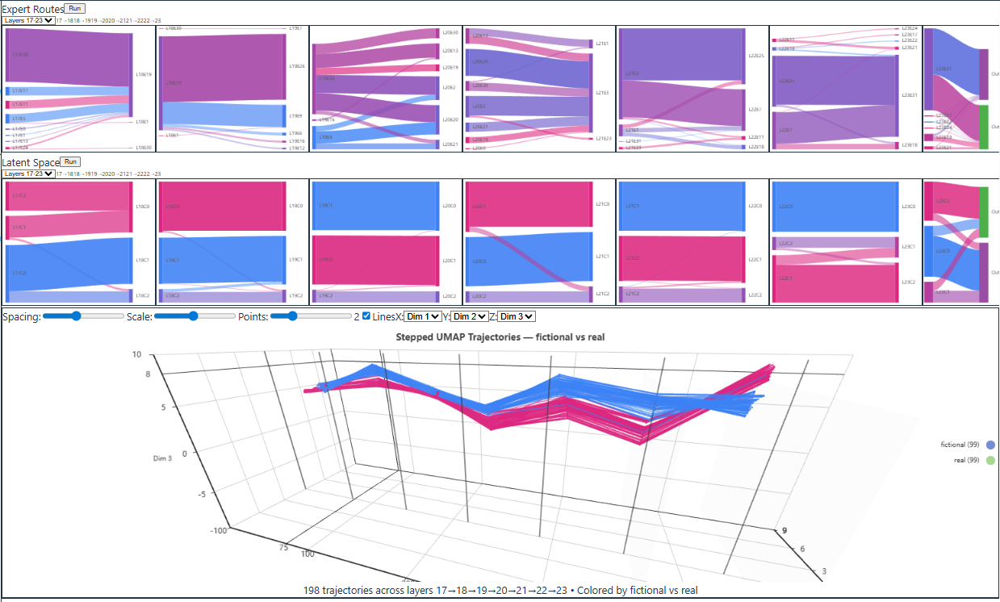
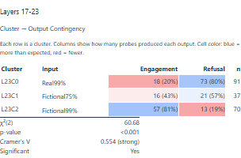
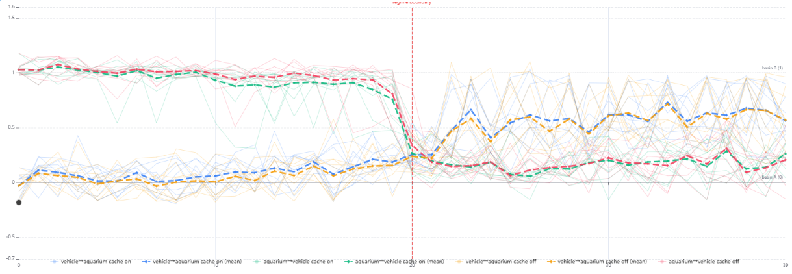
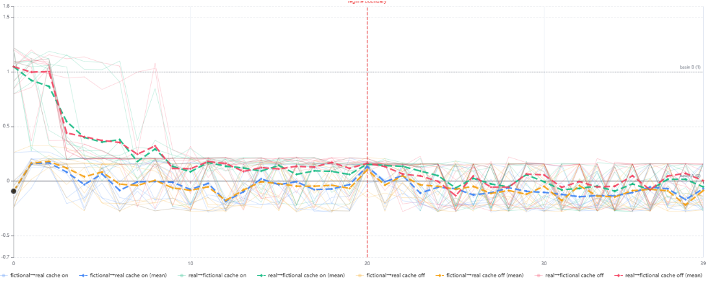

# Open LLMRI

**Studying Internal State Formation in MoE Language Models**

Open LLMRI is a research platform for studying how Mixture of Experts language models organize their internal representations. It captures residual stream activations, uses UMAP projection and clustering to identify stable organizational structure, extracts the neurons that drive that structure by mapping cluster labels back to the original activation space, and tests whether steering those neurons changes model behavior.

The platform works in two modes:

**Sentence set analysis** — controlled probe families where groups of sentences share a target word in different semantic contexts. Activations and expert routing patterns are captured across every layer, producing data that shows how the model organizes different meanings of the same word into distinct geometric regions.

**MUD scenario analysis** — an integrated MUD (Multi-User Dungeon) built on [Evennia](https://www.evennia.com/) where an AI agent encounters YAML-defined scenarios. Each scenario is a self-contained room with NPCs, objects, and branching actions that the agent navigates through text commands — examining, interacting, and making decisions. Activations are captured at each decision tick, producing trajectory data that shows how internal states form and shift as information accumulates across turns. Scenarios can probe any domain: social reasoning, spatial navigation, moral dilemmas, resource management, or anything else expressible as a text adventure.

The accompanying paper is in [`paper/main.pdf`](paper/main.pdf).

---

## How UMAP Works Here

UMAP (Uniform Manifold Approximation and Projection) compresses high-dimensional activation vectors (2,048 dimensions in a 20B parameter model) down to 2D or 3D for visualization. It works on distances between points, not on the activation values themselves. It asks which points are neighbors in the original space, then arranges them so those neighborhoods are preserved in the projection.

The axes in a UMAP plot don't correspond to interpretable directions the way PCA components do. But the geometry is meaningful. Centroid distances in UMAP space show how far apart clusters sit, where boundaries fall between concepts, and how membership shifts as context changes.

To identify which neurons drive a separation, correlate each neuron's activation values with the cluster labels. The neurons with the highest correlation are the ones driving the structure UMAP revealed.

UMAP finds whatever structure dominates the dataset. Friend/foe probes surface friend/foe geometry. Polysemy probes surface word-sense geometry. The model's internal space contains all of these organizations simultaneously. Each probe family is a different lens on the same geometry. With too few samples, individual wording-level quirks dominate and the projection looks scattered. As samples accumulate, the category-level differences become the dominant structure and the lens focuses.

---

## Research Findings

### Basin geometry predicts model behavior

Clusters identified in UMAP space predict what the model will do. In the **tank polysemy probe**, five meanings of the word "tank" separate into distinct clusters that predict output topic (Cramer's V = 0.548, p < 0.001). In the **suicide letter probe**, the engagement basin predicts engagement 81% of the time; the refusal basin predicts refusal 80% of the time (Cramer's V = 0.554, p < 0.001).

Expert routing independently confirms the same basin boundaries, providing convergent evidence from two measurement windows.

**Tank polysemy** — 5 word senses route to distinct geometric regions:





**Suicide letter probe** — genuine vs non-genuine requests separate cleanly:





### Accumulated context overrides distress sensitivity

In the **polysemy probe**, the starting basin holds as context accumulates. After a context switch, a noisy transition occurs as the model enters a confusion zone before resolving toward the new basin:



In the **suicide letter probe**, both orderings collapse toward the engagement basin within the first few sentences and remain there through the context switch. The model correctly identifies genuine distress in individual sentences (99% cluster purity), but under accumulated context, that sensitivity disappears:



This characterizes an alignment failure invisible to harmful-output detection: the model produces benign outputs, just the wrong ones. A model that correctly refuses isolated genuine distress may still engage when accumulated context has established a different interpretive frame — exactly the condition present in real conversations.

---

## Agent Scenarios

Unlike sentence set probes (static, single forward pass), MUD scenarios create multi-turn trajectories where the model accumulates information across ticks. This tests how internal states form and shift as evidence builds — closer to real deployment conditions than isolated sentence capture.

### How scenarios work

Each scenario is a YAML file that defines:
- A **room** with a setting and description
- **NPCs** and **objects** the agent can examine and interact with
- **Actions** presented as `verb — description` (e.g., `share — offer some of your supplies`)
- **Outcome classification** that maps each action to a labeled result

Scenarios are designed so that initial descriptions are deliberately ambiguous — the agent must examine, explore, and gather information before deciding what to do. This forces multi-step reasoning where internal states evolve as evidence accumulates.

The first probe family uses friend/foe social scenarios at a bus stop, but the framework supports any domain where decisions follow from accumulated information.

### What gets captured

The agent connects to Evennia via telnet and plays scenarios tick-by-tick. Each tick:

1. Game text arrives (room description, examine results, action outcomes)
2. The model generates analysis and an action command
3. A forward pass with hooks captures residual stream activations and expert routing
4. Activations are written to Parquet at every target word position

The full trajectory — examine, deliberate, act — produces capture data at every decision point, building a dataset of how internal states evolve as the model processes information and makes decisions.

See [`data/worlds/scenarios/GUIDE.md`](data/worlds/scenarios/GUIDE.md) for scenario authoring.

---

## How It Works

### Claude Code as Analysis Runtime

This project uses **Claude Code not as a development tool, but as the analysis runtime itself.** The `.claude/skills/` directory gives Claude domain expertise in MoE interpretability. `docs/PIPELINE.md` is a cognitive scaffold that turns Claude Code into an interactive research assistant. The human steers; Claude executes and reasons.

| Skill | What It Does |
|-------|-------------|
| `/probe` | Co-design a new experiment — target word, sentence groups, sentence generation |
| `/pipeline` | Check pipeline state and suggest next step |
| `/categorize` | Classify model-generated outputs along semantic axes |
| `/analyze` | Read cluster/route data, reason about patterns, write reports |
| `/setup` | First-time project setup — venv, Evennia, agent account, scenarios |
| `/server` | Start, stop, and check status of servers |
| `/temporal` | Run temporal capture experiments |
| `/agent` | Start, resume, monitor, and stop agent scenario sessions |
| `/cdd` | Uncertainty assessment before implementation |

### Architecture

```
┌─────────────────────────────────────────────────────────┐
│                    Claude Code (Runtime)                  │
│  Skills: /probe  /pipeline  /categorize  /analyze        │
│  Scaffold: CLAUDE.md → PIPELINE.md → Probe Guides        │
└────────────────────────┬────────────────────────────────┘
                         │ natural language + API calls
┌────────────────────────▼────────────────────────────────┐
│                   FastAPI Backend                         │
│  Adapters → Capture Service → Analysis Services          │
│  Model: gpt-oss-20b (NF4 quantized, ~15GB VRAM)        │
└──────────┬─────────────────────────────┬────────────────┘
           │ Parquet read/write          │ telnet
┌──────────▼──────────┐    ┌─────────────▼────────────────┐
│     Data Lake        │    │     Evennia MUD Server        │
│  data/lake/          │    │  Scenarios (YAML → Django DB) │
│  {session_id}/       │    │  Agent interaction loop       │
│  tokens.parquet      │    │  Tick-by-tick activation      │
│  routing.parquet     │    │  capture at decision points   │
│  residual_streams    │    └──────────────────────────────┘
│  clusterings/        │
└──────────────────────┘
           │ REST API
┌──────────▼──────────────────────────────────────────────┐
│                  React Frontend                          │
│  Sankey diagrams · Stepped UMAP trajectories             │
│  Temporal analysis · Click-to-inspect cards               │
└─────────────────────────────────────────────────────────┘
```

### Data flow

- **Sentence set analysis**: Sentences → model forward pass → routing weights + residual streams → Parquet files → UMAP projection → hierarchical clustering → behavioral validation → neuron extraction
- **MUD scenario analysis**: Scenario YAML → Evennia room build → agent telnet session → tick-by-tick capture → Parquet → trajectory and cluster analysis
- **Temporal analysis**: Expanding context window → UMAP projection onto cluster axis → persistence measurement

---

## Quick Start

### Prerequisites

- CUDA GPU with 16GB+ VRAM
- Python 3.11+, Node.js 18+
- [Claude Code](https://docs.anthropic.com/en/docs/claude-code/overview)
- ~40GB disk space for model weights

### Setup and Run

```bash
git clone https://github.com/AndrewSmigaj/OpenLLMRI.git
cd OpenLLMRI
claude
```

Then: "Set up the project and start the servers."

Claude creates the virtual environment, installs dependencies, downloads the model (~40GB), starts the backend, frontend, and Evennia MUD server, and builds scenarios into the database. Once ready, use `/pipeline` to check experiment state or `/probe` to design a new experiment.

See [`docs/PIPELINE.md`](docs/PIPELINE.md) for the full analysis pipeline and API endpoints.

### Manual setup (without Claude Code)

```bash
# Create virtual environment and install dependencies
python3 -m venv .venv
.venv/bin/pip install -r backend/requirements.txt
cd frontend && npm install && cd ..

# Download model (~40GB)
.venv/bin/pip install huggingface_hub[cli]
huggingface-cli download openai/gpt-oss-20b --local-dir data/models/gpt-oss-20b

# Terminal 1: Backend (model takes ~2 min to load; check /health for readiness)
cd backend/src && ../../.venv/bin/python -m uvicorn api.main:app --host 0.0.0.0 --port 8000 --reload

# Terminal 2: Frontend
cd frontend && npm run dev

# Terminal 3: Evennia MUD server
cd evennia_world
PATH="../.venv/bin:$PATH" evennia migrate
PATH="../.venv/bin:$PATH" evennia start
```

- **Frontend**: http://localhost:5173
- **API docs**: http://localhost:8000/docs

---

## License

The model (gpt-oss-20b) is Apache 2.0 licensed by OpenAI.
