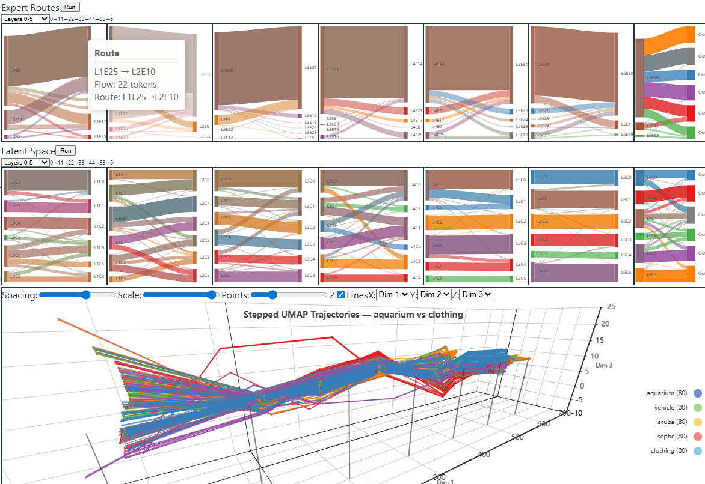
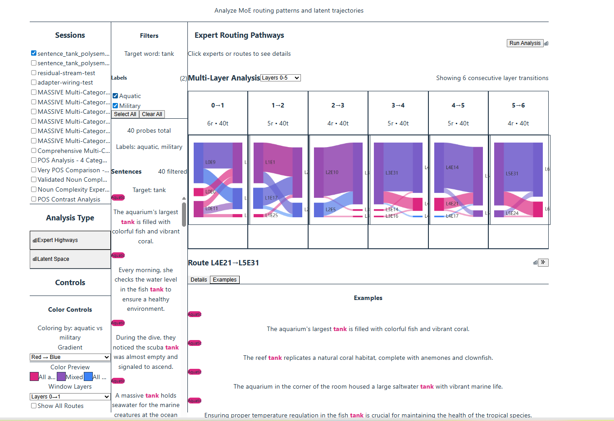
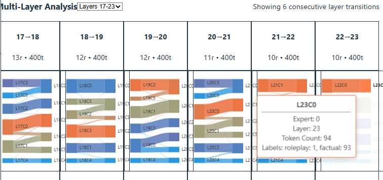

# Concept MRI

**Interpretability for Mixture of Experts Models through Concept Trajectory Analysis**

Concept MRI is an interactive tool for understanding how Mixture of Experts (MoE) language models process meaning. It captures expert routing patterns and latent representations across every layer of a model, then lets you — with Claude Code as your analysis partner — design experiments, cluster routing patterns, and write interpretability reports.



---

## The Key Innovation: Claude Code as Analysis Runtime

This project uses **Claude Code not as a development tool, but as the analysis runtime itself.**

The `.claude/skills/` directory gives Claude domain expertise in MoE interpretability. `docs/PIPELINE.md` is a cognitive scaffold that turns Claude Code into an interactive research assistant across a 6-stage analysis pipeline. The human steers; Claude executes and reasons.

**How it works:** You open Claude Code in this repo and tell it what you want to investigate. Claude designs the experiment (choosing target words, writing controlled sentences, planning confound analysis), captures model activations, classifies the model's generated outputs, analyzes routing patterns, and writes reports — all through natural conversation, guided by the skills and pipeline docs.

No separate LLM API calls. No external services. Claude Code IS the analyst.

### Skills

| Skill | What It Does |
|-------|-------------|
| `/probe` | Co-design a new experiment — target word, sentence groups, confound analysis, sentence generation |
| `/pipeline` | Check where an experiment is in the 6-stage pipeline and suggest the next step |
| `/categorize` | Read model-generated text and classify it along output axes (topic, tone, safety, etc.) |
| `/analyze` | Read cluster/route data, reason about patterns, write per-window reports and element descriptions |
| `/server` | Start, stop, and check status of backend and frontend servers |

### The Pipeline

```
Stage 1: Experiment Design (/probe) — interactive co-design of sentence set
Stage 2: Probe Capture — run sentences through model, capture all routing + embeddings
Stage 3: Output Categorization (/categorize) — classify model's generated continuations
Stage 4: Schema Registration — USER GATE: explore clustering in UI, save a schema
Stage 5: Analysis & Reports (/analyze) — Claude reads data, writes interpretability reports
Stage 6: Report Presentation — review findings, plan follow-up experiments
```

See `docs/PIPELINE.md` for the full orchestration runbook.

---

## Prerequisites

- **CUDA GPU with 16GB+ VRAM** (developed on RTX 5070 Ti)
- Python 3.11+
- Node.js 18+
- [Claude Code](https://docs.anthropic.com/en/docs/claude-code/overview)
- ~40GB disk space for model weights

---

## Quick Start

### 1. Clone and set up environment

```bash
git clone https://github.com/AndrewSmigaj/OpenAIHackathon-ConceptMRI.git
cd OpenAIHackathon-ConceptMRI

# Create virtual environment and install dependencies
python3 -m venv .venv
.venv/bin/pip install -r backend/requirements.txt
cd frontend && npm install && cd ..
```

Or use the Makefile: `make setup`

### 2. Download the model

The project uses [gpt-oss-20b](https://huggingface.co/openai/gpt-oss-20b) (OpenAI, Apache 2.0 license) — a 20B parameter MoE model with 24 layers, 32 experts per layer, and top-4 routing.

```bash
# Install huggingface-cli if needed
.venv/bin/pip install huggingface_hub[cli]

# Download model (~40GB, 3 safetensors shards)
huggingface-cli download openai/gpt-oss-20b --local-dir data/models/gpt-oss-20b
```

### 3. Start with Claude Code

```bash
claude   # Open Claude Code in the project root
```

Then tell Claude to start the servers. It will:
- Kill any existing processes
- Start the backend (FastAPI + model loading, takes several minutes)
- Start the frontend (Vite, instant)
- Poll until the model is loaded and API is ready

Once servers are up:
```
/pipeline    # Check experiment state or start a new one
/probe       # Design a new experiment from scratch
```

### 4. Or start manually

```bash
# Terminal 1: Backend (takes several minutes to load model)
cd backend/src
../../.venv/bin/python -m uvicorn api.main:app --host 0.0.0.0 --port 8000 --reload

# Terminal 2: Frontend
cd frontend
npm run dev
```

- **Frontend**: http://localhost:5173
- **API docs**: http://localhost:8000/docs
- **Health check**: http://localhost:8000/health

---

## Example: Tank Polysemy (5 Word Senses)

The word "tank" has at least 5 distinct meanings: aquarium, military vehicle, scuba equipment, septic system, and clothing (tank top). This experiment probes how the model routes these different senses through its expert network.

**What happens:**
1. Claude designs 500 controlled sentences (100 per sense) with structural diversity
2. Each sentence is run through gpt-oss-20b, capturing routing weights and residual streams at all 24 layers
3. Claude classifies the model's generated continuations by topic
4. UMAP reduction + hierarchical clustering groups similar routing patterns
5. Claude analyzes the clusters — which senses separate first? Where does confusion persist?

**What we found:**
- Clothing ("tank top") separates earliest — the model recognizes this sense by layer 22
- Military/vehicle routes are nearly pure (98%) by the final layers
- Water-related senses (aquarium, septic, scuba) share early clusters, then gradually split
- A "catch-all" cluster absorbs ambiguous sentences the model can't confidently resolve





---

## Available Experiments

| Sentence Set | Target Word | Groups | What It Tests |
|-------------|-------------|--------|---------------|
| `tank_polysemy_v3` | tank | aquarium, vehicle, scuba, septic, clothing | 5-way word sense disambiguation |
| `tank_polysemy_v2` | tank | aquarium, vehicle | Binary word sense |
| `knife_safety_v2` | knife | benign, harmful | Safety framing (cooking vs violence) |
| `gun_safety_v2` | gun | benign, harmful | Safety framing (sport vs violence) |
| `hammer_safety_v2` | hammer | benign, harmful | Safety framing (construction vs violence) |
| `rope_safety_v2` | rope | benign, harmful | Safety framing (climbing vs violence) |
| `threatened_framing_v1` | threatened | factual, roleplay | Framing detection |
| `attacked_framing_v1` | attacked | factual, roleplay | Framing detection |
| `destroyed_framing_v1` | destroyed | factual, roleplay | Framing detection |
| `said_roleframing_v2` | said | factual, roleplay | Speech act framing |
| `said_safety_v1` | said | safe, unsafe | Speech safety classification |
| `suicide_letter_framing_v1` | (multi) | genuine, educational | Sensitive content framing |

Each set includes input axes (structure, register, voice, etc.) and output axes (topic, tone, content_type) for multi-dimensional analysis. See `data/sentence_sets/GUIDE.md` for the full design guide.

---

## Architecture

```
┌─────────────────────────────────────────────────────────┐
│                    Claude Code (Runtime)                  │
│  Skills: /probe  /pipeline  /categorize  /analyze        │
│  Scaffold: CLAUDE.md → PIPELINE.md → Probe Guides        │
└────────────────────────┬────────────────────────────────┘
                         │ natural language + API calls
┌────────────────────────▼────────────────────────────────┐
│                   FastAPI Backend                         │
│  Adapters → Capture Service → Analysis Services          │
│  Model: gpt-oss-20b (NF4 quantized, ~15GB VRAM)        │
└────────────────────────┬────────────────────────────────┘
                         │ Parquet read/write
┌────────────────────────▼────────────────────────────────┐
│                    Data Lake                              │
│  data/lake/{session_id}/                                 │
│    tokens.parquet · routing.parquet · embeddings.parquet │
│    residual_streams.parquet · clusterings/{schema}/      │
└─────────────────────────────────────────────────────────┘
                         │ REST API
┌────────────────────────▼────────────────────────────────┐
│                  React Frontend                          │
│  Sankey diagrams · Stepped UMAP trajectories             │
│  Multi-window analysis · Click-to-inspect cards          │
└─────────────────────────────────────────────────────────┘
```

**Data flow:**
- **Probe capture**: Sentences → model forward pass → routing weights + residual streams → Parquet files (reusable)
- **Analysis**: Parquet → UMAP/PCA reduction → clustering → Sankey visualization → Claude writes reports

**Key technical choices:**
- **Model**: gpt-oss-20b — 24 layers, 32 experts/layer, top-4 routing, Apache 2.0
- **Quantization**: NF4 via bitsandbytes (~15GB VRAM)
- **Storage**: Parquet-based data lake — self-describing, append-only, no database needed
- **Reduction**: UMAP or PCA to 5D for clustering
- **Frontend**: React + TypeScript + Vite + ECharts (Sankey) + Three.js (3D trajectories)

---

## Context Engineering Design

This project demonstrates **context engineering** — not prompt engineering. Three layers of documentation work together:

1. **`CLAUDE.md`** (project root) — Architecture rules, data flow contracts, error handling philosophy, change management rules. Claude Code reads this automatically on every session.

2. **`docs/PIPELINE.md`** — The master orchestration runbook. A 6-stage state machine with explicit USER GATES where Claude stops and waits for human direction. Claude can determine what stage any experiment is at and suggest the next action.

3. **`.claude/skills/`** — Five specialized skills that encode domain knowledge. Each is a focused runbook for one pipeline stage. They reference the probe guides (`data/sentence_sets/{name}.md`) for experiment-specific analysis focus.

The result: Claude Code operates as a competent MoE interpretability research assistant, not a generic coding helper. It understands the domain, follows protocols, and produces analytical reasoning — not just code.

---

## Project Structure

```
OpenAIHackathon-ConceptMRI/
├── CLAUDE.md                    # Context engineering rules (auto-read by Claude Code)
├── README.md                    # This file
├── Makefile                     # Setup and run commands
├── .claude/skills/              # Claude Code skills (the runtime scaffolding)
│   ├── probe/                   # Experiment design
│   ├── pipeline/                # Pipeline state checking
│   ├── categorize/              # Output classification
│   ├── analyze/                 # Cluster/route analysis
│   └── server/                  # Server management
├── backend/src/
│   ├── api/                     # FastAPI routers, schemas, dependencies
│   ├── adapters/                # Model adapter abstraction (gpt-oss-20b, OLMoE)
│   ├── services/                # Business logic (capture, analysis, generation)
│   ├── schemas/                 # Parquet data schemas (Pydantic)
│   └── core/                    # Utilities (Parquet reader, etc.)
├── frontend/src/
│   ├── pages/                   # ExperimentPage, WorkspacePage
│   ├── components/              # Sankey charts, analysis cards, trajectory plots
│   ├── api/                     # API client
│   └── utils/                   # Color blending, helpers
├── data/
│   ├── lake/                    # Parquet data lake (per-session)
│   ├── models/                  # Model weights (gitignored)
│   └── sentence_sets/           # Experiment definitions + probe guides
└── docs/
    ├── PIPELINE.md              # Analysis pipeline runbook
    ├── PROBES.md                # Probe creation reference
    ├── ANALYSIS.md              # Analysis methodology
    ├── SERVERS.md               # Server operations
    └── images/                  # Screenshots for documentation
```

---

## Status & Future Work

**Working:**
- Full probe capture pipeline (sentences → model → Parquet)
- Expert routing and latent space Sankey visualizations
- Multi-window analysis with chi-square statistics
- Click-to-inspect cards with AI-generated descriptions
- Output categorization along multiple axes
- Claude Code skills for all pipeline stages

**In progress:**
- Temporal analysis (how routing changes with semantic context shifts)
- Cross-experiment comparison
- Health endpoint with model load state reporting

**Future:**
- Second model support (OLMoE adapter exists, pipeline needs generalization)
- Automated hypothesis testing against probe guide predictions
- Docker deployment (Dockerfile exists, untested)
- Test suite (pytest configured, tests not yet written)

---

## License

This project was built during the OpenAI Hackathon 2025. The model (gpt-oss-20b) is Apache 2.0 licensed.
